# AquaCheck

<p align="center">
  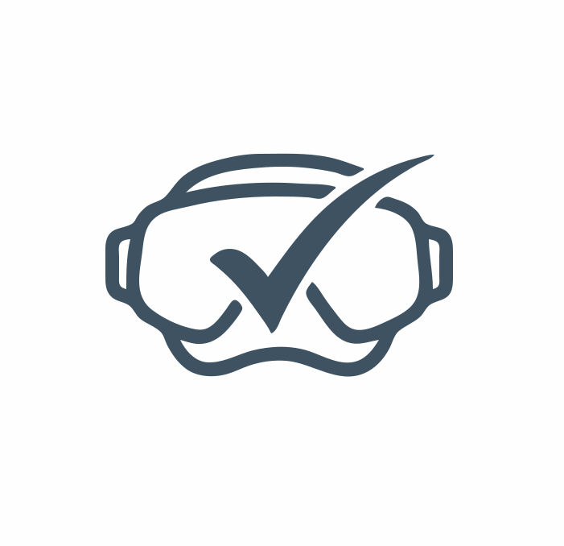
</p>

<p align="center">
  <strong>Sistema Móvil de Apoyo para el Pre-Chequeo y Seguridad del Buceo</strong>
  <br />
  <em>Digitalización ágil, trazable y segura del proceso de verificación previa a la inmersión</em>
</p>

<p align="center">
  
  
  
  
  
</p>

---

## Índice
1. [Descripción del Proyecto](#-descripción-del-proyecto)
2. [Problemática y Propuesta de Valor](#-problemática-y-propuesta-de-valor)
3. [Usuarios y Roles](#-usuarios-y-roles)
4. [Definición del MVP](#-definición-del-mvp)
5. [Flujo de Usuario y Diagrama UML](#-flujo-de-usuario-y-diagrama-uml)
6. [Identidad Visual y Sistema de Diseño](#-identidad-visual-y-sistema-de-diseño)
7. [Interfaces de la Aplicación](#-interfaces-de-la-aplicación)
8. [Evidencias y Documentación](#-evidencias-y-documentación)
9. [Equipo de Desarrollo](#-equipo-de-desarrollo)

---

## Descripción del Proyecto

**AquaCheck** es una solución móvil nativa para Android diseñada para apoyar y modernizar las operaciones de buceo profesional y acuícola. La aplicación transforma las listas de chequeo analógicas en un sistema digital ágil, permitiendo a supervisores y buzos registrar antecedentes médicos, evaluar el equipamiento técnico mediante estándares normativos (**DPR 24** y **AST**), capturar evidencia fotográfica geolocalizada en terreno y obtener un dictamen preliminar automático sobre la aptitud del buzo antes de iniciar la faena marina.

---

## Problemática y Propuesta de Valor

### El Problema
En faenas acuícolas y de buceo comercial, el proceso tradicional de pre-chequeo depende de planillas físicas de papel y anotaciones manuales. Esto acarrea dificultades operativas críticas:
- **Vulnerabilidad a condiciones marítimas:** El papel se deteriora ante el agua salada, viento y humedad.
- **Pérdida u omisión de datos:** La consolidación manual retarda la comunicación y propicia inconsistencias o registros incompletos.
- **Riesgo en seguridad y salud ocupacional:** Decisiones tardías o no fundamentadas sobre la aptitud física del buzo o el estado de sus equipos aumentan el riesgo de accidentes laborales subacuáticos.

### Nuestra Propuesta de Valor
- **Decisión de aptitud inmediata:** El motor de evaluación calcula automáticamente el estado preliminar (`Apto` u `Observado`) analizando respuestas de salud y listas de verificación.
- **Trazabilidad total:** Historial digital auditable por buzo, faena y fecha.
- **Operación en terreno:** Interfaz ergonómica de alto contraste y botones de fácil pulsación con guantes, orientada a funcionamiento autónomo y persistencia offline.

---

## Usuarios y Roles

| Rol | ¿Qué necesita hacer? | Desafío actual que resuelve |
| :--- | :--- | :--- |
| **Supervisor de Buceo** (Principal) | Administrar el flujo de chequeos, auditar datos de salud y equipo, registrar observaciones y validar el estado de aptitud previo al agua. | Elimina la consolidación manual en papel y previene la omisión de factores excluyentes. |
| **Buzo** (Secundario) | Ingresar sus datos de salud pre-buceo, responder encuestas de bienestar físico y certificar la revisión de su equipamiento. | Garantiza un control continuo de sus parámetros médicos y condiciones de inmersión seguras. |

---

## Definición del MVP

El Producto Mínimo Viable (MVP) se enfoca en resolver el núcleo del problema de seguridad y pre-inmersión:

### Funcionalidades Incluidas en el MVP
1. **Autenticación e inicio de sesión:** Acceso seguro según rol (Supervisor / Buzo).
2. **Registro de nuevo chequeo:** Creación de sesión de control asociando fecha, buzo y equipo.
3. **Checklist digital estructurada:** Verificación conforme a normativas obligatorias **DPR 24** y **AST**.
4. **Registro de salud del buzo:** Formulario de parámetros pre-inmersión y encuesta rápida de sintomatología.
5. **Captura de evidencia fotográfica:** Uso de la cámara del dispositivo para adjuntar fotografías del equipo y notas explicativas.
6. **Cálculo automático de aptitud preliminar:** Algoritmo que clasifica al operador en estado **Apto** o con **Observación** inmediata ante inconsistencias.
7. **Panel e historial de chequeos:** Visualización del historial cronológico de controles realizados.

### Las 4 Funcionalidades Imprescindibles
En caso de máxima restricción de alcance, el núcleo inamovible de la solución comprende:
1. Checklist digital DPR 24 / AST.
2. Cálculo automático de aptitud preliminar.
3. Registro de parámetros de salud del buzo.
4. Historial/panel de chequeos para trazabilidad.

### Fuera del Alcance en esta Etapa
- Importación masiva de fichas médicas vía archivos externos (Excel, CSV, JSON).
- Monitoreo telemétrico en tiempo real subacuático (profundidad continua, mezclas de gases mediante sensores IoT).
- Integración directa con ERP o sistemas corporativos de recursos humanos externos.

### Requerimientos No Funcionales
- **Rendimiento:** Tiempos de respuesta inferiores a 2 segundos en validaciones y cálculos.
- **Usabilidad en terreno:** Botones y tarjetas de dimensiones grandes, accesibles con guantes de trabajo o visibilidad reducida.
- **Resiliencia:** Soporte para persistencia y almacenamiento local offline cuando no exista conectividad en alta mar.

---

## Flujo de Usuario y Diagrama UML

El recorrido del usuario sigue una secuencia estricta para garantizar que ningún chequeo omita pasos críticos de seguridad.

### Recorrido Principal
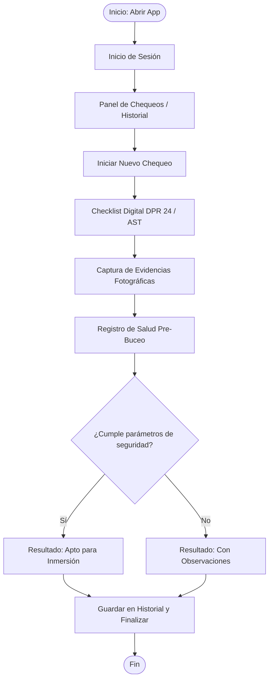

### Diagrama de Actividad UML Oficial
El diagrama de actividad formal que modela las bifurcaciones y actividades del sistema se encuentra disponible en [`docs/diseño/flujo-usuario-uml.png`](docs/diseño/flujo-usuario-uml.png):

<p align="center">
  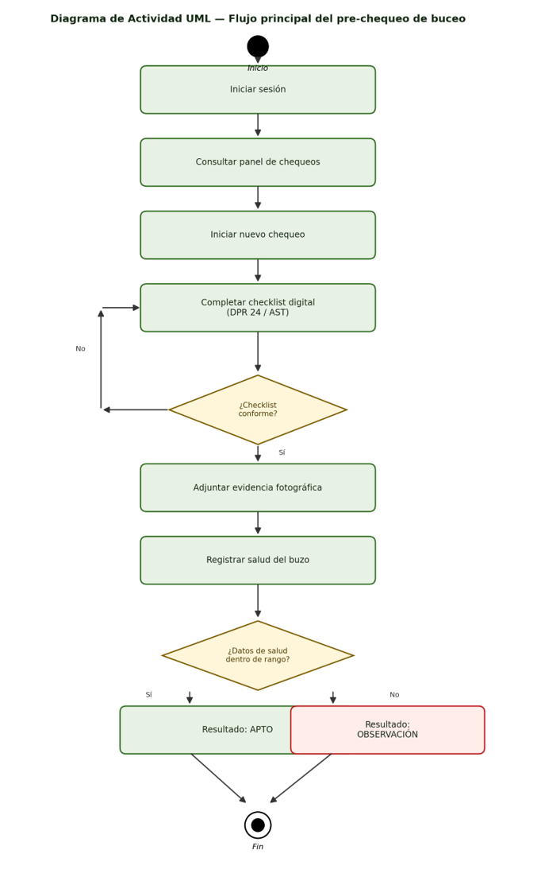
</p>

---

## Identidad Visual y Sistema de Diseño

El sistema visual de **AquaCheck** fue concebido siguiendo las directrices de **Material Design 3**, buscando transmitir seguridad, tranquilidad y alta legibilidad bajo luz natural o condiciones adversas.

### Logotipo
El isotipo fusiona un **visor submarino** con un **check de confirmación**, simbolizando la verificación y validación rigurosa de las condiciones de buceo antes de cada descenso.
- **Archivo:** [`docs/diseño/Logo.svg`](docs/diseño/Logo.svg)

### Paleta de Colores
| Muestra | Nombre | Código HEX | Rol y Aplicación en la Interfaz |
| :---: | :--- | :---: | :--- |
|  | **Principal** | `#12260E` | Botones de acción principal, Floating Action Button (FAB), títulos de marca y texto en estados aprobatorios. |
|  | **Secundario / Contenedor** | `#D6E8CF` | Fondos de tarjetas de estado **Apto**, chips de selección y elementos de confirmación. |
|  | **Fondo** | `#F6F8F4` | Fondo neutro general de pantallas y áreas de contenido. |
|  | **Texto Principal** | `#1C1C1C` | Tipografía principal sobre superficies claras para máxima legibilidad. |
|  | **Alerta / Error** | `#BA1A1A` | Texto e íconos de advertencia para el estado **Observado** o campos no aptos. |
|  | **Contenedor Alerta** | `#FFEDEA` | Fondo de tarjetas y banners cuando un parámetro no cumple las normas de seguridad. |

---

## Interfaces de la Aplicación

Las pantallas fueron diseñadas y prototipadas en **Figma** y estructuradas para su implementación en **Jetpack Compose**.

### Catálogo de Interfaces
| Pantalla | Propósito | Componentes Material Design 3 | Archivo de Diseño |
| :--- | :--- | :--- | :--- |
| **Inicio de Sesión** | Identificación del usuario por credenciales. | `TextField`, `Button (Filled)` | [`login.png`](docs/diseño/Interfaces/login.png) |
| **Panel de Chequeos** | Historial de chequeos recientes y acceso a nueva revisión. | `TopAppBar`, `Card`, `FloatingActionButton`, `NavigationBar` | [`panel_chequeos.png`](docs/diseño/Interfaces/panel_chequeos.png) |
| **Nuevo Chequeo** | Formulario con datos de la inmersión, buzo asignado y fecha. | `TopAppBar`, `TextField`, `Button (Filled)` | [`nuevo_chequeo.png`](docs/diseño/Interfaces/nuevo_chequeo.png) |
| **Lista de Verificación** | Checklist digital conforme a reglamentación DPR 24 y AST. | `TopAppBar`, `Checkbox`, `Switch`, `Button (Filled)` | [`checklist.png`](docs/diseño/Interfaces/checklist.png) |
| **Evidencias** | Captura fotográfica con la cámara y notas de cumplimiento. | `TopAppBar`, `Button (Outlined)`, `Icon`, `Button (Filled)` | [`evidencias.png`](docs/diseño/Interfaces/evidencias.png) |
| **Salud del Buzo** | Registro de parámetros pre-inmersión y encuesta fisiológica. | `TopAppBar`, `TextField`, `Button (Filled)` | [`salud_buzo.png`](docs/diseño/Interfaces/salud_buzo.png) |
| **Resumen Preliminar** | Emisión automática de dictamen de aptitud previo a inmersión. | `TopAppBar`, `Card`, `Button (Filled)` | [`resumen_preliminar.png`](docs/diseño/Interfaces/resumen_preliminar.png) |
| **Dashboard - Buzo Apto** | Visualización en verde del buzo habilitado para la faena. | `Card (Container)`, `Icon`, `Button` | [`dashboard-buzo-apto.png`](docs/diseño/Interfaces/dashboard-buzo-apto.png) |
| **Dashboard - Observado** | Visualización de advertencia para un buzo con observaciones. | `Card (Error Container)`, `Icon`, `Button` | [`dashboard-buzo-observado.png`](docs/diseño/Interfaces/dashboard-buzo-observado.png) |
| **Perfil** | Visualización y gestión de datos del usuario autenticado. | `TopAppBar`, `Card`, `NavigationBar` | [`perfil.png`](docs/diseño/Interfaces/perfil.png) |

---

### Galería Visual de Pantallas

<p align="center">
  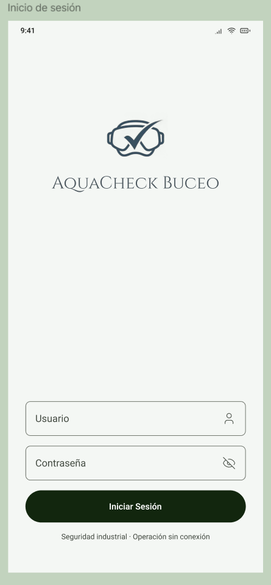
  &nbsp;&nbsp;
  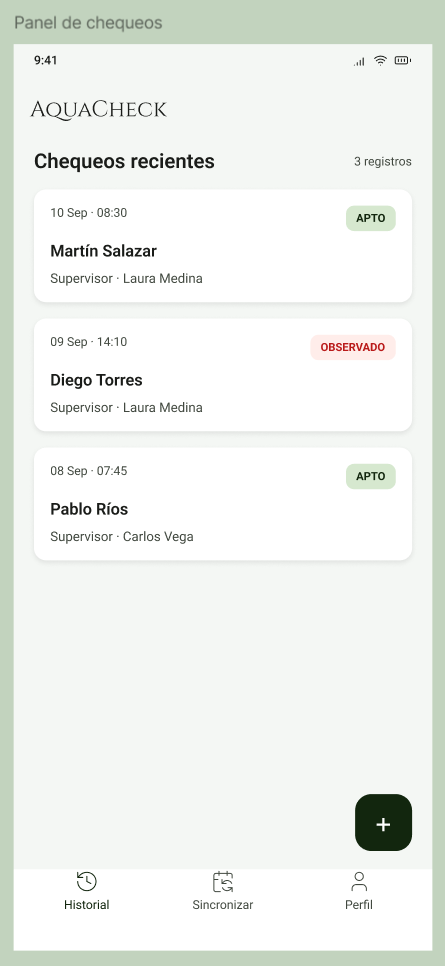
  &nbsp;&nbsp;
  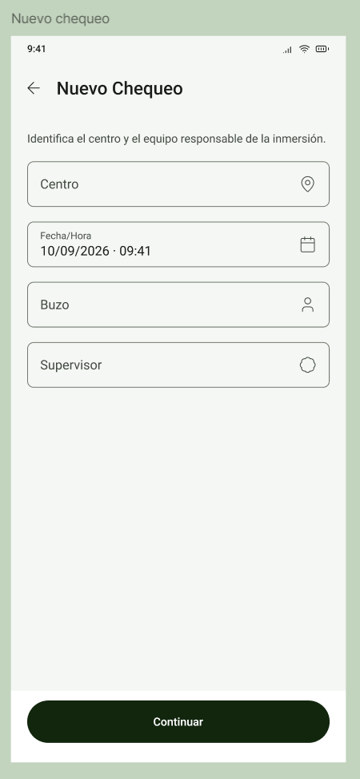
</p>

<p align="center">
  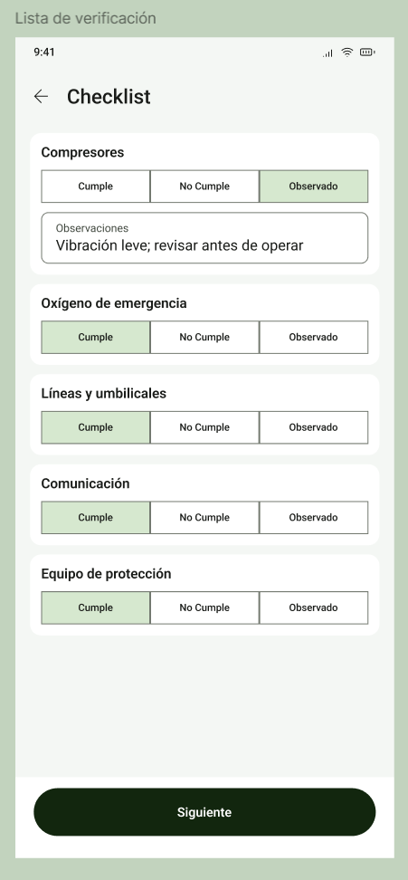
  &nbsp;&nbsp;
  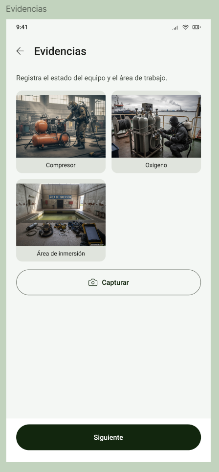
  &nbsp;&nbsp;
  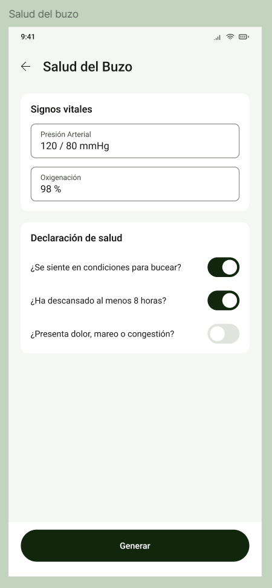
</p>

<p align="center">
  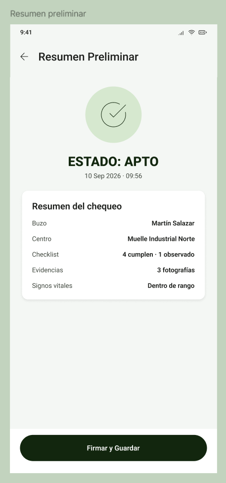
  &nbsp;&nbsp;
  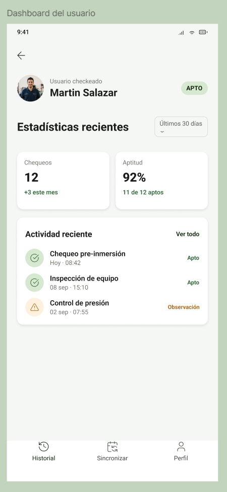
  &nbsp;&nbsp;
  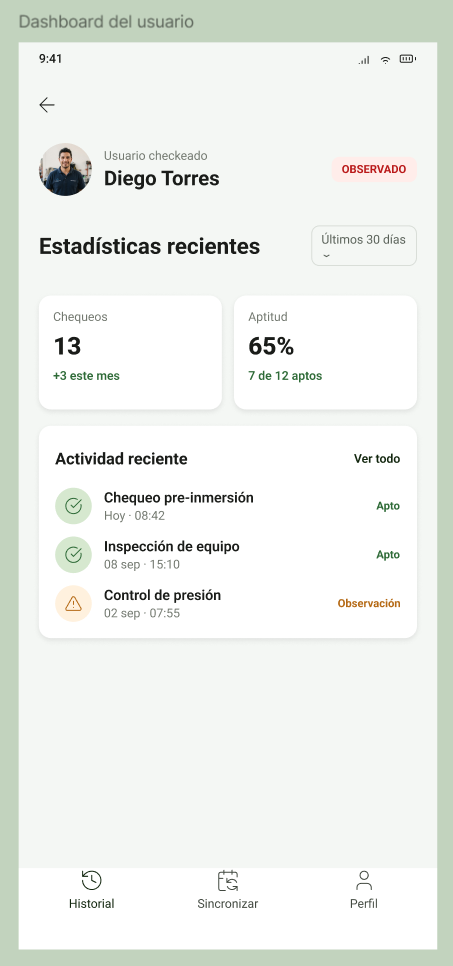
</p>

<p align="center">
  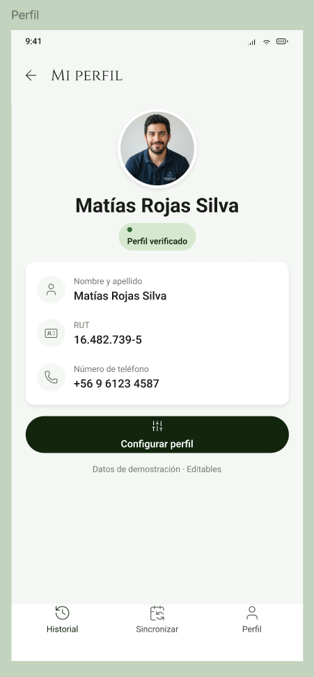
</p>

---

## Evidencias y Documentación

Toda la documentación técnica y actas académicas del proyecto se encuentran centralizadas en el repositorio:

-  **Clase 01 - Del Problema del Cliente al MVP:**  
  [`docs/Evidencias/Evidencia_Clase_01_MVP_EquipoSixSeven.docx`](docs/Evidencias/Evidencia_Clase_01_MVP_EquipoSixSeven.docx)  
  *Contiene el análisis de problemática, identificación de usuarios, matriz de requerimientos y delimitación del MVP.*

-  **Clase 02 - Flujo de Usuario y Diseño de Interfaces:**  
  [`docs/Evidencias/Evidencia_Clase_02_Diseno_EquipoSixSeven.docx`](docs/Evidencias/Evidencia_Clase_02_Diseno_EquipoSixSeven.docx)  
  *Contiene la definición de identidad visual, especificación de paleta Material 3, diagrama UML y catalogación de pantallas Figma.*

### Estructura del Repositorio
```text
AquaCheck/
├── README.md                                  # Documentación general del proyecto
└── docs/
    ├── Evidencias/                            # Documentos formales de evaluación
    │   ├── Evidencia_Clase_01_MVP_EquipoSixSeven.docx
    │   └── Evidencia_Clase_02_Diseno_EquipoSixSeven.docx
    └── diseño/                                # Activos de diseño e interfaces
        ├── Logo.svg                           # Logotipo vectorial oficial
        ├── flujo-usuario-uml.png              # Diagrama de Actividad UML
        └── Interfaces/                        # Diseños en alta fidelidad (Figma)
            ├── checklist.png
            ├── dashboard-buzo-apto.png
            ├── dashboard-buzo-observado.png
            ├── evidencias.png
            ├── login.png
            ├── nuevo_chequeo.png
            ├── panel_chequeos.png
            ├── perfil.png
            ├── resumen_preliminar.png
            └── salud_buzo.png
```

---

##  Equipo de Desarrollo

**Equipo: SixSeven (Sección 002D)**

- **Sergio Sepúlveda** - *Líder de Proyecto / Backend* - [GitHub](https://github.com/SerjioKLO)
- **Gabriel Zurita** - *Frontend / Backend*
